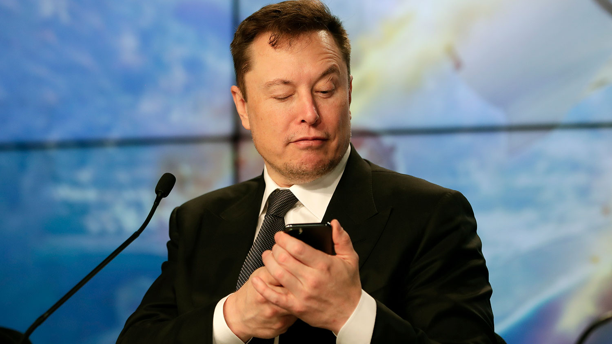

# Elon Musk’s 2 Rules For Learning Anything Faster

Learning is one of the overcommunicated but underleveraged tools of the common entrepreneur.

Everyone talks about methods of learning, but few people find realistic and authentic techniques that actually yield a net profit in the information and application categories.

Elon Musk has broken through that barrier with learning techniques that have proven successful not just once, but time and time again.

A good argument could be made that Musk has leveraged his learning by becoming a disruptor. He and his companies have shifted entire industries, including the transportation sector, the energy sector, and the space sector.

He recently announced at a press conference that his plans for his biotech company Neuralink are progressing quite nicely, hinting at yet another sector which his hands will likely shift in the coming years.

Yes, Musk is a once-in-a-lifetime genius. Likely on the same levels as Nikola Tesla, Albert Einstein, Isaac Newton. He has a different way of viewing problems than the average entrepreneur.

Of course, he reads hundreds of books. He works with top-level thinkers. He has astronomical levels of funding to put towards his every whim. But that’s not what makes him a great learner.

His learning methods aren’t that regal. In fact, his two rules for how to learn anything faster can be implemented by anyone at any time. Including you.
You, too, can be a rocket scientist, if you wanted. Here’s how.

Identify the different parts of the tree
When it comes to learning, Musk is quick to note that he believes that most people can learn more than they currently know.

When it comes to the average entrepreneur, Musk claims that they often don’t break through their perceived limits and try to learn beyond their current capacity. Or, as he goes on to clarify, they don’t know how to outline their information in a way that leads to further revelation.

From this, we begin to see Elon Musk’s first rule of learning:

## Rule #1 — Make sure you’re building a tree of knowledge
What does this mean for you practically? It helps the common entrepreneur understand that not everything is weighed with equal gravitas or importance.
When it comes to learning, there is a difference between material that ends up hanging from a branch and the material that makes up the base of the trunk of your tree.

It’s the periphery vs. the central.
Musk is a master of understanding what is at the core of each of the sectors his entrepreneurial ventures sit in.
He starts there, ensuring that he has the best possible grasp on the “trunk” material before moving off into the minutiae of the branches and the leaves.

Many of us do the opposite. We load up on periphery facts while never fully understanding how or why they connect back to the trunk. This outward-facing-in method leaves many of our brains overcrowded with misidentified and, ultimately, unimportant knowledge.

